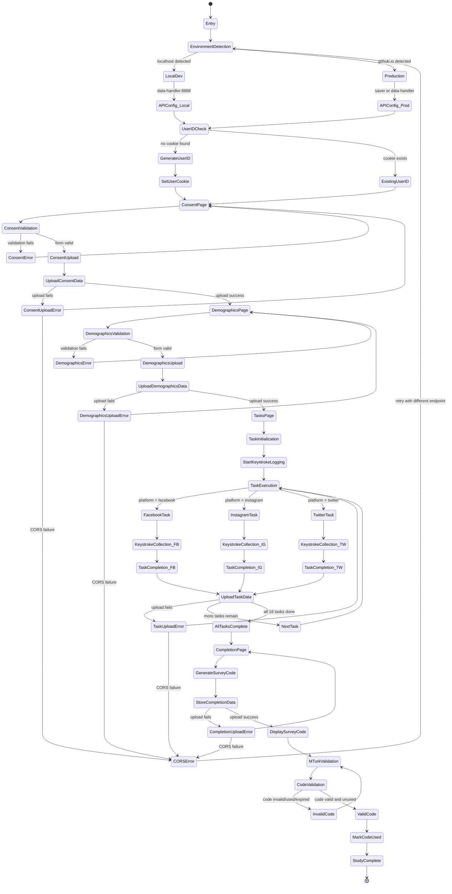

# 🔍 Web Data Collection System

A comprehensive web application for collecting keystroke dynamics data from participants in a controlled research environment. This system implements a complete user journey from consent to data collection across multiple social media platforms.

## 🎯 System Overview

This research platform collects typing dynamics data through an 18-task study spanning Facebook, Instagram, and Twitter interfaces. The system includes automated consent management, demographic data collection, real-time keystroke capture, and MTurk integration for participant compensation.

## 🔄 System Architecture & Flow



### 🔍 [Interactive State Diagram](./state-diagram-visual.html)
View the complete system flow with zoom, export capabilities, and detailed state descriptions.

### ⏱️ [Interactive Sequence Diagrams](./sequence-diagram-interactive.html)
Explore temporal interactions with 5 detailed sequence views: Complete Journey, Error Handling, Environment Routing, Keystroke Collection, and Survey Code Lifecycle.

## 📁 Project Structure

```
web-data-collection/
├── 📄 state-diagram-visual.html      # Interactive system visualization
├── 📄 STATE_DIAGRAM.md               # Complete state documentation
├── 📄 VISUAL_EXPORTS.md              # Export guide for diagrams
├── 🏗️  netlify/functions/             # Serverless backend
│   ├── data-handler.js               # Consolidated API handler
│   └── utils/supabase-utils.js       # Database utilities
├── 📱 pages/hosting/                  # Study flow pages
│   ├── consent.html                  # IRB consent form
│   ├── demographics.html             # Participant data collection
│   ├── tasks.html                    # Main task controller
│   └── complete.html                 # Completion & code generation
├── 🎮 pages/fake_pages/              # Social media clones
│   ├── Facebook-Clone/               # Facebook interface
│   ├── instagram-clone/              # Instagram interface
│   └── twitter-clone/                # Twitter interface
├── ⚙️  utils/                         # Shared utilities
│   └── common.js                     # Core functions & API handling
└── 🎨 styles/                        # Global styling
    └── global.css                    # Consistent UI theme
```
## Credits

[The original Facebook clone](https://github.com/KashanAdnan/Facebook-Clone)

[The original Instagram clone](https://github.com/leocosta1/instagram-clone)

## Participate
>  ⚠️ **_NOTE:_**  To avoid any potential issues with browser caching and cookie retention, it is recommended to use a fresh private browser instance

Click [here](https://fakeprofiledetection.github.io/web-data-collection/pages/hosting/consent.html) to participate in data collection
