# Web Data Collection System - Sequence Diagrams

## Overview
This document contains sequence diagrams showing the temporal flow and interactions between different components in the web data collection research system.

## 1. Complete User Journey Sequence

```mermaid
sequenceDiagram
    participant U as 👤 User
    participant B as 🌐 Browser
    participant ENV as 🔧 Environment Detection
    participant API as 🔗 API Router
    participant CF as ☁️ Netlify Functions
    participant SB as 🗄️ Supabase Storage
    participant MT as 💰 MTurk System

    %% Initial Entry
    U->>B: Opens study URL
    B->>ENV: Detect environment (local/production)
    ENV->>API: Configure API endpoints
    API-->>B: Return endpoint configuration
    
    %% User ID Management
    B->>B: Check for existing user_id cookie
    alt No existing cookie
        B->>B: Generate secure user ID (crypto)
        B->>B: Set secure cookie (24h expiry)
    end
    
    %% Consent Phase
    B->>U: Display consent form
    U->>B: Fill consent form
    B->>B: Validate consent data
    B->>API: POST /data-handler?action=upload-file
    API->>CF: Route to upload handler
    CF->>CF: Validate file upload
    CF->>CF: Security checks & MIME validation
    CF->>SB: Upload consent.json
    SB-->>CF: Upload confirmation
    CF-->>API: Success response
    API-->>B: Consent uploaded successfully
    
    %% Demographics Phase
    B->>U: Display demographics form
    U->>B: Fill demographics data
    B->>B: Validate demographics data
    B->>API: POST /data-handler?action=upload-file
    API->>CF: Route to upload handler
    CF->>SB: Upload demographics.json
    SB-->>CF: Upload confirmation
    CF-->>API: Success response
    API-->>B: Demographics uploaded successfully
    
    %% Task Execution Phase
    B->>U: Display task instructions
    U->>B: Start task execution
    
    loop For each of 18 tasks
        B->>B: Initialize keystroke logger
        B->>U: Load platform interface (FB/IG/TW)
        U->>B: Perform typing task
        
        par Parallel Keystroke Collection
            B->>B: Capture keydown events
            B->>B: Capture keyup events
            B->>B: Calculate timing metrics
            B->>B: Buffer keystroke data
        end
        
        U->>B: Complete task
        B->>B: Stop keystroke logging
        B->>B: Prepare CSV data
        B->>API: POST /data-handler?action=upload-file
        API->>CF: Route to upload handler
        CF->>SB: Upload task_data.csv
        SB-->>CF: Upload confirmation
        CF-->>API: Task data uploaded
        API-->>B: Ready for next task
    end
    
    %% Completion Phase
    B->>B: Generate unique survey code
    Note over B: Format: TASK-[timestamp36]-[random6]-[userHash4]
    B->>API: POST /data-handler?action=store-completion
    API->>CF: Route to completion handler
    CF->>CF: Validate completion data
    CF->>SB: Upload completion.json
    SB-->>CF: Upload confirmation
    CF-->>API: Completion stored
    API-->>B: Survey code generated
    B->>U: Display survey code & instructions
    
    %% MTurk Validation Phase
    U->>MT: Enter survey code in MTurk
    MT->>API: POST /data-handler?action=validate-code
    API->>CF: Route to validation handler
    CF->>SB: Search completion files
    SB-->>CF: Return matching completion data
    CF->>CF: Validate code (unused, not expired)
    CF->>SB: Mark code as used
    SB-->>CF: Update confirmation
    CF-->>API: Code validation result
    API-->>MT: Valid code response
    MT-->>U: Payment authorized
```

## 2. Error Handling & Recovery Sequence

```mermaid
sequenceDiagram
    participant U as 👤 User
    participant B as 🌐 Browser
    participant API as 🔗 API Router
    participant CF as ☁️ Netlify Functions
    participant SB as 🗄️ Supabase Storage

    %% Upload Error Scenario
    U->>B: Submit form data
    B->>API: POST /data-handler?action=upload-file
    API->>CF: Route to upload handler
    CF->>SB: Attempt file upload
    SB-->>CF: ❌ Upload failed (network/storage error)
    CF-->>API: ❌ Error response (500)
    API-->>B: ❌ Upload failed
    
    %% Error Recovery
    B->>B: Display error message to user
    B->>B: Wait 2 seconds (exponential backoff)
    B->>API: 🔄 Retry upload request
    API->>CF: Route to upload handler (retry)
    CF->>SB: Attempt file upload (retry)
    SB-->>CF: ✅ Upload successful
    CF-->>API: ✅ Success response
    API-->>B: ✅ Upload completed
    B->>U: Continue to next step
    
    %% CORS Error Scenario
    Note over B,CF: Production CORS Error
    U->>B: Submit data from GitHub Pages
    B->>API: POST to melodious-squirrel.netlify.app
    API->>CF: Route request
    CF-->>API: ❌ CORS policy violation
    API-->>B: ❌ CORS error (blocked)
    
    %% CORS Recovery
    B->>B: Detect CORS error
    B->>API: Switch to fallback endpoint
    API->>CF: Route with proper CORS headers
    CF->>CF: Apply dynamic CORS origin
    CF-->>API: ✅ Request successful (with CORS)
    API-->>B: ✅ Data uploaded
    B->>U: Continue normally
```

## 3. Environment-Specific Routing Sequence

```mermaid
sequenceDiagram
    participant U as 👤 User
    participant B as 🌐 Browser
    participant ENV as 🔧 Environment Detection
    participant API as 🔗 API Router
    participant LOCAL as 🏠 Local Functions
    participant PROD as 🌍 Production Functions
    participant SB as 🗄️ Supabase Storage

    U->>B: Access application
    B->>ENV: window.location.hostname
    
    alt Local Development
        ENV-->>API: localhost detected
        API->>API: Configure local endpoints
        Note over API: http://localhost:8888/.netlify/functions/data-handler
        B->>API: API request
        API->>LOCAL: Route to local data-handler
        LOCAL->>SB: Process request
        SB-->>LOCAL: Response
        LOCAL-->>API: Success
        API-->>B: Local response
        
    else Production Environment  
        ENV-->>API: github.io detected
        API->>API: Configure production endpoints
        Note over API: https://melodious-squirrel.netlify.app/.netlify/functions/
        
        alt New data-handler available
            Note over API: Check for data-handler function
            B->>API: API request
            API->>PROD: Route to data-handler
            PROD->>SB: Process request
            SB-->>PROD: Response
            PROD-->>API: Success
            API-->>B: Production response
            
        else Fallback to legacy saver
            Note over API: Fallback to existing saver function
            B->>API: API request  
            API->>PROD: Route to legacy saver
            PROD->>SB: Process request
            SB-->>PROD: Response
            PROD-->>API: Success
            API-->>B: Fallback response
        end
    end
```

## 4. Real-time Keystroke Collection Sequence

## 5. Survey Code Lifecycle Sequence

```mermaid
sequenceDiagram
    participant U as 👤 User
    participant B as 🌐 Browser
    participant CF as ☁️ Netlify Functions
    participant SB as 🗄️ Supabase Storage
    participant MT as 💰 MTurk Worker
    participant MTS as 🏢 MTurk System

    %% Code Generation
    U->>B: Complete all 18 tasks
    B->>B: Generate survey code
    Note over B: TASK-[timestamp36]-[random6]-[userHash4]
    B->>CF: Store completion data
    CF->>SB: Save completion.json with code
    Note over SB: code_used: false, expires_at: +48h
    SB-->>CF: Completion stored
    CF-->>B: Code ready
    B->>U: Display survey code
    
    %% Code Usage
    U->>MT: Provide survey code in MTurk
    MT->>MTS: Submit HIT with code
    MTS->>CF: Validate survey code
    CF->>SB: Search completion files by code
    SB-->>CF: Return completion data
    
    alt Code validation checks
        CF->>CF: Check if code exists
        CF->>CF: Check if code not used
        CF->>CF: Check if code not expired (48h)
        CF->>CF: ✅ All checks pass
        CF->>SB: Mark code as used
        Note over SB: code_used: true, used_timestamp: now
        SB-->>CF: Code marked as used
        CF-->>MTS: ✅ Valid code - approve payment
        
    else Code already used
        CF->>CF: ❌ Code marked as used
        CF-->>MTS: ❌ Invalid - code already used
        
    else Code expired
        CF->>CF: ❌ Code older than 48 hours
        CF-->>MTS: ❌ Invalid - code expired
        
    else Code not found
        CF->>CF: ❌ Code not in system
        CF-->>MTS: ❌ Invalid - code not found
    end
    
    MTS-->>MT: Payment decision
    MT-->>U: Payment result
```

## Key Sequence Insights

### **Timing Characteristics:**
- **Consent Phase**: ~2-3 minutes
- **Demographics Phase**: ~3-5 minutes  
- **Task Execution**: ~45-60 minutes (18 tasks × 2-3 min each)
- **Completion Phase**: ~1-2 minutes
- **Total Study Time**: ~50-70 minutes

### **Critical Points:**
1. **User ID Generation**: Must happen before any data collection
2. **Keystroke Logging**: Runs parallel to user interaction
3. **Error Recovery**: Automatic retry with exponential backoff
4. **Environment Routing**: Determines function availability
5. **Code Validation**: One-time use with 48-hour expiry

### **Parallel Processes:**
- **Keystroke Collection**: Continuous during task execution
- **Data Buffering**: Real-time event processing
- **Upload Operations**: Background file transmission
- **Error Monitoring**: Continuous throughout journey

### **Error Recovery Patterns:**
- **Network Errors**: Automatic retry with backoff
- **CORS Errors**: Fallback endpoint routing
- **Validation Errors**: User feedback and correction
- **Storage Errors**: Retry with alternative endpoints

These sequence diagrams provide a temporal view of how your web data collection system orchestrates complex interactions between frontend, backend, and external services while maintaining data integrity and user experience.