# Web Data Collection System - State Diagram

## System Overview
This repository implements a comprehensive keystroke dynamics research study with multi-platform data collection, user consent management, and automated survey code generation for MTurk integration.

## Complete System State Diagram

```mermaid
stateDiagram-v2
    [*] --> Entry
    
    %% Entry and Environment Detection
    Entry --> EnvironmentDetection
    EnvironmentDetection --> LocalDev : localhost detected
    EnvironmentDetection --> Production : github.io detected
    
    %% Environment-specific API routing
    LocalDev --> APIConfig_Local : data-handler:8888
    Production --> APIConfig_Prod : saver or data-handler
    
    %% User ID Management
    APIConfig_Local --> UserIDCheck
    APIConfig_Prod --> UserIDCheck
    UserIDCheck --> GenerateUserID : no cookie found
    UserIDCheck --> ExistingUserID : cookie exists
    GenerateUserID --> SetUserCookie
    SetUserCookie --> ConsentPage
    ExistingUserID --> ConsentPage
    
    %% Consent Flow
    ConsentPage --> ConsentValidation
    ConsentValidation --> ConsentError : validation fails
    ConsentValidation --> ConsentUpload : form valid
    ConsentError --> ConsentPage
    ConsentUpload --> UploadConsentData
    UploadConsentData --> ConsentUploadError : upload fails
    UploadConsentData --> DemographicsPage : upload success
    ConsentUploadError --> ConsentPage
    
    %% Demographics Flow
    DemographicsPage --> DemographicsValidation
    DemographicsValidation --> DemographicsError : validation fails
    DemographicsValidation --> DemographicsUpload : form valid
    DemographicsError --> DemographicsPage
    DemographicsUpload --> UploadDemographicsData
    UploadDemographicsData --> DemographicsUploadError : upload fails
    UploadDemographicsData --> TasksPage : upload success
    DemographicsUploadError --> DemographicsPage
    
    %% Tasks Flow
    TasksPage --> TaskInitialization
    TaskInitialization --> StartKeystrokeLogging
    StartKeystrokeLogging --> TaskExecution
    
    %% Task Execution States
    TaskExecution --> FacebookTask : platform = facebook
    TaskExecution --> InstagramTask : platform = instagram  
    TaskExecution --> TwitterTask : platform = twitter
    
    %% Platform-specific task states
    FacebookTask --> KeystrokeCollection_FB
    InstagramTask --> KeystrokeCollection_IG
    TwitterTask --> KeystrokeCollection_TW
    
    %% Keystroke Collection (parallel process)
    KeystrokeCollection_FB --> TaskCompletion_FB
    KeystrokeCollection_IG --> TaskCompletion_IG
    KeystrokeCollection_TW --> TaskCompletion_TW
    
    TaskCompletion_FB --> UploadTaskData
    TaskCompletion_IG --> UploadTaskData
    TaskCompletion_TW --> UploadTaskData
    
    %% Task Data Upload
    UploadTaskData --> TaskUploadError : upload fails
    UploadTaskData --> NextTask : more tasks remain
    UploadTaskData --> AllTasksComplete : all 18 tasks done
    TaskUploadError --> TaskExecution
    NextTask --> TaskExecution
    
    %% Completion Flow
    AllTasksComplete --> CompletionPage
    CompletionPage --> GenerateSurveyCode
    GenerateSurveyCode --> StoreCompletionData
    StoreCompletionData --> CompletionUploadError : upload fails
    StoreCompletionData --> DisplaySurveyCode : upload success
    CompletionUploadError --> CompletionPage
    DisplaySurveyCode --> MTurkValidation
    
    %% MTurk Validation Flow
    MTurkValidation --> CodeValidation
    CodeValidation --> InvalidCode : code invalid/used/expired
    CodeValidation --> ValidCode : code valid and unused
    InvalidCode --> MTurkValidation
    ValidCode --> MarkCodeUsed
    MarkCodeUsed --> StudyComplete
    
    %% Error Recovery States
    ConsentUploadError --> CORSError : CORS failure
    DemographicsUploadError --> CORSError : CORS failure
    TaskUploadError --> CORSError : CORS failure
    CompletionUploadError --> CORSError : CORS failure
    
    CORSError --> EnvironmentDetection : retry with different endpoint
    
    %% Final States
    StudyComplete --> [*]
    
    %% Parallel Data Management Process
    state DataManagement {
        [*] --> FileValidation
        FileValidation --> SecurityCheck
        SecurityCheck --> SupabaseUpload
        SupabaseUpload --> StorageConfirmation
        StorageConfirmation --> [*]
    }
    
    %% Function Routing Logic
    state FunctionRouting {
        [*] --> DetectEnvironment
        DetectEnvironment --> LocalFunction : localhost
        DetectEnvironment --> ProductionFunction : production
        LocalFunction --> DataHandler : data-handler available
        ProductionFunction --> SaverFunction : saver available
        ProductionFunction --> DataHandler : data-handler deployed
        DataHandler --> ActionRouting
        SaverFunction --> LegacyRouting
        ActionRouting --> UploadFile : action=upload-file
        ActionRouting --> StoreCompletion : action=store-completion
        ActionRouting --> ValidateCode : action=validate-code
        LegacyRouting --> FileUploadOnly
        UploadFile --> [*]
        StoreCompletion --> [*]
        ValidateCode --> [*]
        FileUploadOnly --> [*]
    }
```



## State Descriptions

### **User Journey States**

1. **Entry**: Initial page load and system initialization
2. **Environment Detection**: Determines local vs production environment
3. **User ID Management**: Generates or retrieves secure user identifier
4. **Consent Flow**: Legal consent collection and validation
5. **Demographics Flow**: Participant demographic data collection
6. **Tasks Flow**: 18 keystroke dynamics tasks across 3 platforms
7. **Completion Flow**: Survey code generation and storage
8. **MTurk Validation**: External code validation for payment

### **Technical System States**

1. **API Configuration**: Environment-specific endpoint routing
2. **Function Routing**: data-handler vs saver function selection
3. **CORS Handling**: Cross-origin request management
4. **Data Management**: File validation, security, and storage
5. **Error Recovery**: Automatic retry and fallback mechanisms

### **Data Collection States**

1. **Keystroke Logging**: Real-time typing dynamics capture
2. **File Upload Pipeline**: Multi-part form data processing
3. **Validation Pipeline**: Form and file content validation
4. **Storage Pipeline**: Supabase cloud storage integration
5. **Code Generation**: Unique survey completion codes

### **Error States and Recovery**

1. **Validation Errors**: Form field validation failures
2. **Upload Errors**: Network or server upload failures
3. **CORS Errors**: Cross-origin policy violations
4. **Function Errors**: Missing or misconfigured functions
5. **Storage Errors**: Supabase storage failures

## Key State Transitions

### **Happy Path Flow**
```
Entry → Consent → Demographics → Tasks (×18) → Completion → MTurk → Complete
```

### **Error Recovery Flows**
```
Upload Error → CORS Error → Environment Detection → Retry
Validation Error → Return to Form → Re-submit
Function Error → Fallback Endpoint → Continue
```

### **Environment-Specific Flows**
```
Local: localhost → data-handler:8888 → Action Routing
Production: github.io → saver/data-handler → Function Routing
```

## Concurrent Processes

1. **Keystroke Collection**: Runs parallel during task execution
2. **Form Validation**: Real-time validation during data entry
3. **File Upload**: Background upload with progress tracking
4. **Error Monitoring**: Continuous error detection and logging

## Critical Decision Points

1. **Environment Detection**: Determines API endpoints and CORS configuration
2. **Function Availability**: Routes between data-handler and saver functions
3. **Upload Validation**: Security and content validation before storage
4. **Code Validation**: MTurk integration and payment verification
5. **Error Recovery**: Automatic retry vs manual intervention

This state diagram represents the complete system architecture and user journey for the web data collection research study, including all error states, recovery mechanisms, and environment-specific behaviors.