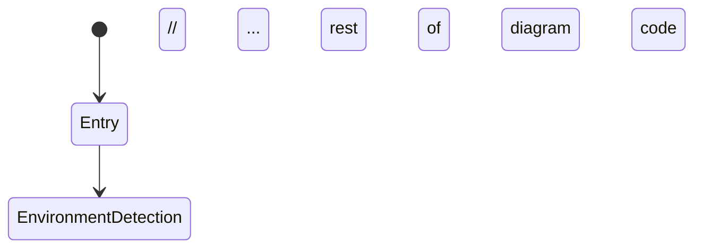

# 🎨 Visual State Diagram Export Guide

## 📋 Quick Start

### **Option 1: Interactive State Diagram (System Overview)**
Open `state-diagram-visual.html` in your browser for:
- 🔍 Zoom and pan capabilities
- 📱 Responsive design
- 📸 One-click PNG/SVG export
- 🎨 Multiple theme options
- 🖨️ Print-ready formatting

### **Option 1b: Interactive Sequence Diagrams (Temporal Flow)**
Open `sequence-diagram-interactive.html` in your browser for:
- ⏱️ 5 different sequence diagram views
- 🚀 Complete user journey timeline
- ⚠️ Error handling and recovery flows
- 🔧 Environment-specific routing
- ⌨️ Real-time keystroke collection
- 🎯 Survey code lifecycle

### **Option 2: Mermaid Live Editor (Professional Quality)**
1. Copy the Mermaid code from `STATE_DIAGRAM.md` or `SEQUENCE_DIAGRAM.md`
2. Go to https://mermaid.live/
3. Paste the code in the editor
4. Export as PNG, SVG, or PDF in high resolution

### **Option 3: GitHub Auto-Rendering**
The state diagram automatically renders in:
- README.md files (when Mermaid syntax is used)
- GitHub Issues and Pull Requests
- GitHub Wiki pages

## 🔧 Export Methods

### **High-Resolution PNG Export**
```bash
# Using Mermaid CLI (if installed)
mmdc -i STATE_DIAGRAM.md -o state-diagram.png -w 2048 -H 1536

# Or use the interactive HTML file export button
```

### **Scalable SVG Export**
```bash
# Using Mermaid CLI
mmdc -i STATE_DIAGRAM.md -o state-diagram.svg -f svg

# SVG is perfect for:
# - Web embedding
# - Scalable presentations
# - Vector graphics editing
```

### **PDF for Documentation**
```bash
# Using Mermaid CLI
mmdc -i STATE_DIAGRAM.md -o state-diagram.pdf -f pdf

# Or print from interactive HTML to PDF
```

## 🎯 Use Cases by Format

### **PNG (Raster Image)**
- ✅ PowerPoint presentations
- ✅ Word documents
- ✅ Web embedding (fixed size)
- ✅ Social media sharing
- ❌ Not ideal for scaling

### **SVG (Vector Graphics)**
- ✅ Web embedding (scalable)
- ✅ Professional documentation
- ✅ Vector editing (Illustrator, Inkscape)
- ✅ High-quality printing
- ✅ Infinite scaling without quality loss

### **Interactive HTML**
- ✅ Live documentation
- ✅ Stakeholder presentations
- ✅ Development reference
- ✅ User training materials
- ✅ Responsive viewing on any device

### **Mermaid Code**
- ✅ GitHub/GitLab integration
- ✅ Version control friendly
- ✅ Easy updates and maintenance
- ✅ Documentation-as-code approach

## 🎨 Professional Styling Options

### **Available Themes in Interactive HTML:**
1. **Default** - Clean, professional blue theme
2. **Dark** - Dark mode for presentations
3. **Forest** - Green nature theme
4. **Neutral** - Grayscale minimal theme

### **Custom Styling Tips:**
```css
/* Add to Mermaid config for custom colors */
%%{init: {
  'theme': 'base',
  'themeVariables': {
    'primaryColor': '#ff6b6b',
    'primaryTextColor': '#fff',
    'primaryBorderColor': '#ff4757',
    'lineColor': '#2f3542'
  }
}}%%
```

## 📐 Recommended Dimensions

### **For Presentations:**
- Width: 1920px (Full HD)
- Height: 1080px
- Format: PNG or SVG

### **For Documentation:**
- Width: 1200px
- Height: Auto
- Format: SVG (scalable)

### **For Web Embedding:**
- Width: 100% (responsive)
- Format: SVG or Interactive HTML

### **For Printing:**
- Width: 300 DPI
- Format: PDF or high-res PNG

## 🚀 Advanced Export Options

### **Using Node.js Script (Professional)**
```javascript
// install: npm install @mermaid-js/mermaid-cli
const { run } = require('@mermaid-js/mermaid-cli');

// Export multiple formats
const formats = ['png', 'svg', 'pdf'];
formats.forEach(format => {
  run([
    '-i', 'STATE_DIAGRAM.md',
    '-o', `exports/state-diagram.${format}`,
    '-w', '2048',
    '-H', '1536'
  ]);
});
```

### **Batch Export Script**
```bash
#!/bin/bash
# Create exports directory
mkdir -p exports

# Export multiple formats
mmdc -i STATE_DIAGRAM.md -o exports/state-diagram-hd.png -w 2048 -H 1536
mmdc -i STATE_DIAGRAM.md -o exports/state-diagram.svg -f svg
mmdc -i STATE_DIAGRAM.md -o exports/state-diagram.pdf -f pdf

echo "✅ All formats exported to exports/ directory"
```

## 🔗 Integration Examples

### **Embed in README.md:**
```markdown
## System Architecture



### **Embed SVG in HTML:**
```html
<object data="state-diagram.svg" type="image/svg+xml">
  
</object>
```

### **Responsive Web Embedding:**
```html
<div style="width: 100%; max-width: 1200px; margin: 0 auto;">
  <iframe src="state-diagram-visual.html" 
          style="width: 100%; height: 800px; border: none;">
  </iframe>
</div>
```

## 📚 Documentation Integration

### **For Research Papers:**
1. Export as high-resolution PNG (300 DPI)
2. Include as figure with proper citation
3. Provide interactive HTML as supplementary material

### **For Technical Documentation:**
1. Use SVG for web documentation
2. Include Mermaid source for version control
3. Link to interactive HTML for detailed exploration

### **For Presentations:**
1. Use PNG for PowerPoint/Keynote
2. Use interactive HTML for live demos
3. Export specific sections for focused discussions

This guide ensures you can create professional, publication-ready visuals of your state diagram in any format needed for your research and documentation.